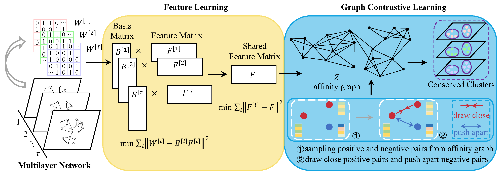

# jNMF-GCL v1.0

### [Graph Contrastive Learning for Clustering of Multi-layer Networks](https://ieeexplore.ieee.org/abstract/document/10360213/)

Yifei Yang, Xiaoke Ma.

jNMF-GCL is an algorithm for conserved module detection in multi-layer networks. The algorithm flow chart is as follows:

